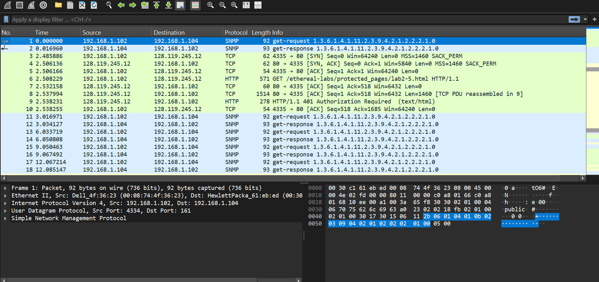
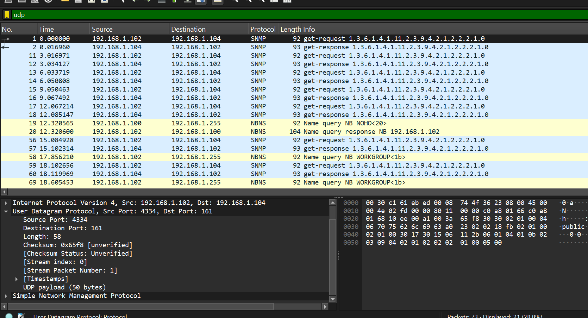
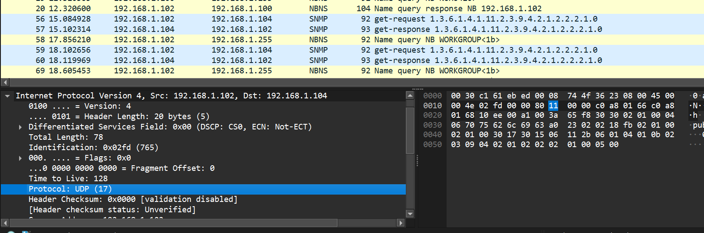
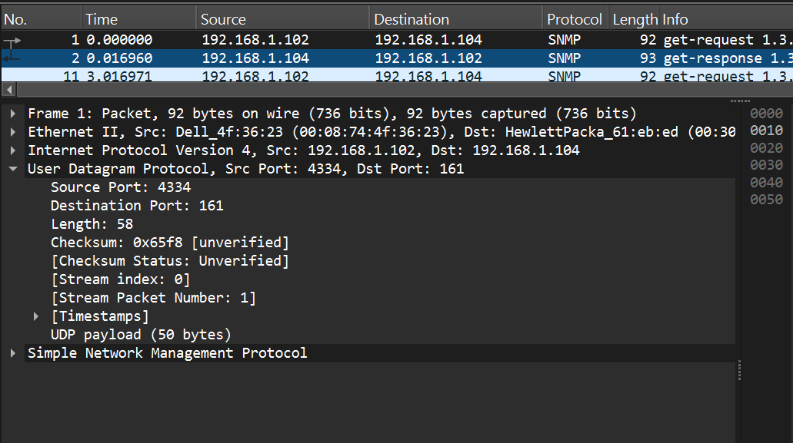
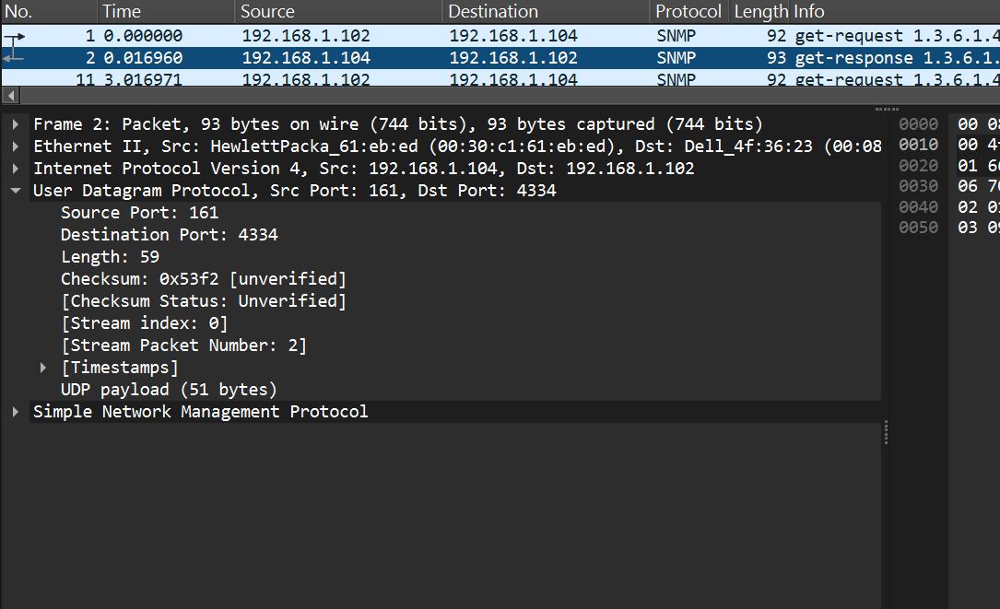

## ARYA BARIQ - 103072400132 - IF0405
# MODUL 5 : UDP
## UDP
UDP (User Datagram Protocol) adalah salah satu protokol pada layer transport dalam model TCP/IP yang digunakan untuk mengirimkan data tanpa koneksi (connectionless). Artinya, UDP tidak melakukan proses pembentukan koneksi terlebih dahulu sebelum mengirim data.

**Langkah-langkah**

1. Download file http://gaia.cs.umass.edu/wireshark-labs/wireshark-traces.zip
2. Extract file dan cari file *http-ethereal-trace-5*
3. Klik kanan file tersebut, lalu buka (open with) dengan wireshark

4. Lakukan filter UDP dan pilih 1 paket UDP (bebas)

**Pertanyaan**
1. Field UDP

Terdapat 4 field : Source Port, Destination Port, Length, Checksum

2. Panjang tiap field Bedasarkan teori UDP :
Source Port → 2 byte
Destination Port → 2 byte
Length → 2 byte
Checksum → 2 byte
Sehingga keseluruhan header UDP berukuran 8 byte.

3. Length

Dari nilai Length = 58, dapat diartikan bahwa total panjang datagram UDP adalah 58 byte, di mana 8 byte digunakan untuk header dan sisanya untuk muatan data. Perhitungan sederhana menunjukkan bahwa data = 58 − 8 = 50 byte. Nilai ini konsisten dengan ukuran UDP payload yang tercatat sebesar 50 byte.

4. Jumlah maksimum byte UDP
Dengan max IP 65535 byte, kurangi header IP (20 byte) dan header UDP (8 byte), sehingga payload UDP maksimum adalah 65507 byte.
ip.dst == 192.168.1.102
5. Karena field port UDP = 16 bit, maka port terbesar yang bisa digunakan adalah 2^16 − 1 = 65535.

6. Nomor protokol UDP

Nomor protokol UDP adalah 17 (desimal) atau 0x11 (heksadesimal)

7. Hubungan port

Pada request: Source Port = 4334, Destination Port = 161. Pada response: Source Port = 161, Destination Port = 4334. Port sumber dan tujuan saling bertukar.
